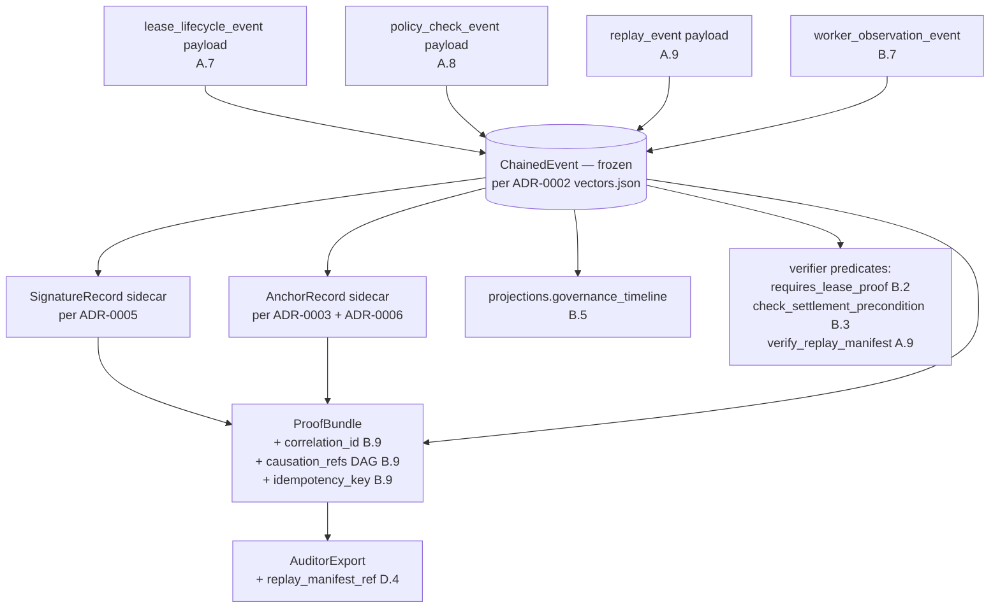

<!--
SPDX-FileCopyrightText: 2026 The Attestplane Authors
SPDX-License-Identifier: Apache-2.0
-->

# AIOS → Attestplane Absorption Map

> **Companion to**: [`docs/validation/aios_to_attestplane_absorption_audit_20260517.md`](../validation/aios_to_attestplane_absorption_audit_20260517.md), [ADR-0009](../adr/0009-aios-absorption-boundary.md), [ADR-0004](../adr/0004-aios-to-attestplane-boundary.md).
> **Status**: read-only mapping. Every absorbed shape must appear here with `source_path` / `shape_absorbed` / `fields_dropped` before its schema lands in `schemas/v1/`.
> **Relationship**: Attestplane (Apache-2.0, this repo) was extracted from AIOS (proprietary commercial product) as the open-source compliance / substrate module. **The founder owns copyright to both repositories.** Verified: Attestplane LICENSE file = Apache-2.0 (`https://github.com/attestplane/attestplane/blob/main/LICENSE`); AIOS = proprietary commercial product (founder-authoritative).
>
> **Hard rule**: no AIOS Rust file appears as a verbatim copy under `sdk/`. The constraint is strategic, not legal — the founder may legally relicense any AIOS file to Apache-2.0 as part of an extraction, but the absorption discipline below prevents authority surface from drifting into the OSS substrate.
>
> Every extraction is either *independent convergence* (zero flow) or *taxonomy reuse with redaction* or *schema-shape re-issue under Attestplane `$id`* (no `$ref` to AIOS).

## 1. Layer model

```mermaid
flowchart TB
  subgraph AIOS[AIOS commercial repo ~/aios/ — proprietary closed-source]
    AIOS_CP[aios-cp 108k — REDLINE]
    AIOS_RT[aios-runtime 67k — REDLINE]
    AIOS_PROTO[aios-protocol 14.8k — REDLINE]
    AIOS_EVAL[aios-eval-gate 1.9k — REDLINE]
    AIOS_REPLAY[aios-replay-runner 969 — REDLINE]
    AIOS_SECRET[aios-secret-broker 409 — REDLINE]
    AIOS_DEDUP[aios-canonical/src/dedup.rs — REDLINE]
    AIOS_AUDIT_CARDINALITY[aios-audit cardinality — REDLINE]
    AIOS_TRANSPORT[aios-sdk-protocol::envelope.rs — REDLINE]
    AIOS_SDK_EVIDENCE[aios-sdk-evidence 465 — boundary SDK]
    AIOS_CANONICAL[aios-canonical/canonical.rs — algorithm only]
    AIOS_SCHEMAS[(schemas/ JSON Schemas)]
  end

  subgraph BARRIER[Open-core extraction discipline — ADR-0004 + ADR-0009]
    BLOCK0[founder may relicense AIOS code<br/>but scope discipline limits extraction]
    BLOCK1[no verbatim AIOS file under sdk/<br/>only schema-shape re-issue]
    BLOCK2[no $ref to AIOS $id]
    BLOCK3[no authority surface]
    BLOCK4[no append-time I/O]
  end

  subgraph ATTEST[Attestplane Apache-2.0 substrate]
    AP_CANON[canonical.py / canonical.ts<br/>A.1 independent convergence]
    AP_TEXT[canonical_text.py / canonical_text.ts<br/>A.2 independent convergence]
    AP_TAX[event_types.py / event_types.ts<br/>A.3 taxonomy with redaction]
    AP_LEASE[/schemas/v1/lease_lifecycle_event.schema.json<br/>A.7 shape from artifact.rs+lease.schema.json/]
    AP_POLICY[/schemas/v1/policy_check_event.schema.json<br/>A.8 shape from policy.schema.json/]
    AP_REPLAY[/schemas/v1/replay_event.schema.json<br/>A.9 shape from replay.rs+replay_proof.schema.json/]
    AP_AUDIT_ENV[docs/spec/evidence-event-taxonomy-v1.md<br/>A.10 shape note from audit.rs]
    AP_VERIFIER[attestplane.verifier — read-only walker]
    AP_BUNDLE[ProofBundle, AuditorExport]
  end

  AIOS_SDK_EVIDENCE -. shape only .-> AP_LEASE
  AIOS_SDK_EVIDENCE -. shape only .-> AP_REPLAY
  AIOS_SDK_EVIDENCE -. shape note only .-> AP_AUDIT_ENV
  AIOS_SCHEMAS -. shape only .-> AP_LEASE
  AIOS_SCHEMAS -. shape only .-> AP_POLICY
  AIOS_SCHEMAS -. shape only .-> AP_REPLAY
  AIOS_CANONICAL -. algorithm reference only .-> AP_CANON
  AIOS_CANONICAL -. algorithm reference only .-> AP_TEXT

  AIOS_CP -. blocked .-> BARRIER
  AIOS_RT -. blocked .-> BARRIER
  AIOS_PROTO -. blocked .-> BARRIER
  AIOS_EVAL -. blocked .-> BARRIER
  AIOS_REPLAY -. blocked .-> BARRIER
  AIOS_SECRET -. blocked .-> BARRIER
  AIOS_DEDUP -. blocked .-> BARRIER
  AIOS_AUDIT_CARDINALITY -. blocked .-> BARRIER
  AIOS_TRANSPORT -. blocked .-> BARRIER

  BARRIER -. permits shape only .-> ATTEST
```



## 2. Mapping table (A-class only)

Eight rows. Every A-class entry MUST appear here before its schema lands. INV-NEW-2 (absorption-map provenance) is enforced by this table's existence.

| ID | AIOS source path | Shape absorbed | Fields explicitly dropped | Attestplane `$id` | `schema_version` | ADR ref |
|---|---|---|---|---|---|---|
| **A.1** | `~/aios/crates/aios-audit/src/lib.rs#L26-L46` (canonical-JSON `sort_value`) | none — **independent convergence**; no flow | n/a | n/a (already shipped) | `chain.schema_version=1` | ADR-0002 |
| **A.2** | `~/aios/crates/aios-canonical/src/canonical.rs` (218 LOC, NEEDS-VERIFY) | none — **independent convergence** | n/a | n/a (already shipped) | n/a | future ADR-0011 |
| **A.3** | `~/aios/crates/aios-sdk-evidence/src/proof.rs#L4-L30` (11 `ProofType` variants) | string-set taxonomy with **authority redaction** | `LiveRuntimeInvariant`, `ProductionLive` (authority assertions per ADR-0004 § 1) | n/a (string list in `event_types.py`) | n/a | ADR-0008 |
| **A.6** | n/a (category definition only) | new absorption category — "schema-shape re-issue" | n/a | n/a | n/a | ADR-0009 |
| **A.7** | `~/aios/crates/aios-sdk-evidence/src/artifact.rs#L28-L43` + `~/aios/schemas/lease/lease.schema.json#L1-L84` | `(lease_id_hash, tenant_id_ref, step_id_ref, run_id_ref, artifact_hash_ref, lifecycle, observed_at, reason_code)` | `signature`, `capability_required`, `budget_cap`, HMAC payload construction, the lease-issuance verb | `https://attestplane.io/schemas/v1/lease_lifecycle_event.schema.json` | `lease_event_schema_version = 1` | ADR-0008 + ADR-0009 |
| **A.8** | `~/aios/schemas/policy/policy.schema.json#L1-L50` | `(policy_id, policy_version, rule_id, kind, effect, severity, expression_hash, evidence_refs[])` | `expression` body (hash-only per ADR-0004 § 2 #10), `PolicyUpdateCandidate` mechanics, `EVAL_REQUIRED` enum value | `https://attestplane.io/schemas/v1/policy_check_event.schema.json` | `policy_event_schema_version = 1` | ADR-0008 + ADR-0009 |
| **A.9** | `~/aios/crates/aios-sdk-evidence/src/replay.rs#L7-L21` + `~/aios/schemas/replay/replay_proof.schema.json#L1-L40` | `(replay_run_id, original_run_id, snapshot_id, artifact_hash, audit_hash, input_hash_match, artifact_hash_match, audit_chain_match, deterministic_result, diff_summary_hash, created_at)` | the **execution** of replay (`aios-replay-runner` — REDLINE C.13), authority-flavoured `proof_type` enum variants | `https://attestplane.io/schemas/v1/replay_event.schema.json` | `replay_event_schema_version = 1` | ADR-0008 + ADR-0009 |
| **A.10** | `~/aios/crates/aios-sdk-evidence/src/audit.rs#L28-L45` (`AuditEnvelope`) | shape note in spec doc: `(tenant_id, run_id, step_id, audit_hash)` quadruple as cross-runtime import hint | `aios-sdk-protocol::envelope.rs` `RequestEnvelope<T>` (transport — REDLINE C.new-3); `task_id` if absent in caller | n/a (spec-doc shape note only) | n/a | future spec doc |

## 3. Redaction policy (column 3 of the mapping above)

Every A-class shape inherits ADR-0004 § 2 column-3 redaction policy. The three substantive drops:

```mermaid
flowchart LR
  subgraph DROP[Always dropped — authority signal]
    D1[signature / signing key body]
    D2[capability / scope expression body]
    D3[budget / quota body]
    D4[policy expression body — hash only]
    D5[secret / token / password]
    D6[ProofType::LiveRuntimeInvariant]
    D7[ProofType::ProductionLive]
    D8[RequestEnvelope&lt;T&gt; transport]
    D9[dedup matrix — semantic similarity state]
  end

  subgraph KEEP[Always permitted — evidence shape]
    K1[lease_id_hash + lifecycle enum]
    K2[policy_id + rule_id + effect + expression_hash]
    K3[artifact_hash_ref / audit_hash]
    K4[observed_at / created_at]
    K5[evidence_refs[] — list of chain event hashes]
  end

  DROP -. always blocked .-> ABSORPTION{A-class absorption}
  KEEP -. always permitted .-> ABSORPTION
```

## 4. Bundle / projection / proof relationship

How absorbed shapes fit into the proof substrate (read-only consumers, never decision-makers):



## 5. REDLINE quick-reference (Section C summary)

What downstream contributors must read first:

| Source path | Posture |
|---|---|
| `~/aios/crates/aios-cp/` | REDLINE (108 K LOC — Control Plane authority) |
| `~/aios/crates/aios-runtime/` | REDLINE (67 K LOC — execution loop) |
| `~/aios/crates/aios-protocol/` | REDLINE (14.8 K LOC — wire transport) |
| `~/aios/crates/aios-eval-gate/` | REDLINE (blocks runs — authority) |
| `~/aios/crates/aios-replay-runner/` | REDLINE (executes replay) |
| `~/aios/crates/aios-secret-broker/` | REDLINE (secret authority) |
| `~/aios/crates/aios-evolver/`, `aios-gene-resolver/` | REDLINE (self-modification) |
| `~/aios/crates/aios-supervisor/` | REDLINE (scheduling) |
| `~/aios/crates/aios-canonical/src/dedup.rs` | REDLINE C.new-1 (semantic-similarity dedup = state-keeping) |
| `~/aios/crates/aios-audit/src/lib.rs` cardinality/orphan layer | REDLINE C.new-2 (AIOS-table-coupled checks) |
| `~/aios/crates/aios-sdk-protocol/src/envelope.rs` `RequestEnvelope<T>` | REDLINE C.new-3 (transport) |
| `~/aios/crates/aios-canonical/src/canonical.rs` | REDLINE pending NEEDS-VERIFY — default deny |
| `~/aios/crates/aios-claude-code-sidecar/` | REDLINE (MEMORY: AIOS adapter impl stays in AIOS commercial) |
| `~/aios/examples/lawyer_real_case_demo.py` | REDLINE (belongs in `~/legal-workspace`) |
| `~/aios/schemas/{lease,settlement}/*` **complete** schemas (request / consume / billing detail) | REDLINE (commercial billing primitives) |
| **Migration-plan ticket #5** — `AIOSAdapter` concrete implementation | REDLINE C.18 (commercial differentiator; per `memory/feedback_attestplane_aios_boundary.md`) |
| **Migration-plan ticket #24** — AIOS-run-to-proof-bundle example | REDLINE C.19 (depends on #5; even synthetic AIOS-named example crosses boundary) |

## 6. Invariants enforced by this map

The absorption map MD itself is a load-bearing artefact for **INV-NEW-2**:

> Every A-class entry in this MD MUST carry three columns — *source path*, *shape absorbed*, *fields explicitly dropped*. An A-class entry without an explicit "fields dropped" column is a documentation bug, not an audit pass.

Two additional invariants this map enforces:

- **INV-NEW-1 (`$id` discipline)**: column 5 above shows `$id` always starts with `https://attestplane.io/`. CI: `jq '.["$id"]' schemas/v1/*.json | grep -v '^"https://attestplane.io/'` must be empty.
- **INV-NEW-3 (no AIOS crate names in Attestplane sources)**: column 1 paths in this map are documentation references only; `sdk/` source code must not reference them. CI: `rg '\baios_(sdk_evidence|sdk_protocol|canonical|audit|cp|runtime|protocol)\b' sdk/` (excluding `aios_spec.py` docstring stub) must return zero hits.

## 7. Add-a-row procedure

To absorb a new AIOS shape (controlled re-issue under Attestplane `$id`):

1. Identify source `.rs` or `.schema.json` path with line range.
2. Enumerate the field set; cross-check ADR-0004 § 1 for any authority signal.
3. Draft the redaction (`fields_dropped` list) — at minimum drop any field matching `signature / token / key / budget / capability / scope_body / policy_expression_body / secret`.
4. Assign Attestplane `$id` under `https://attestplane.io/schemas/v1/...`.
5. Assign a fresh `<event_kind>_schema_version = 1` (do not reuse `chain.schema_version` / `anchor_schema_version` / `signature_schema_version` / `reason_code_schema_version`).
6. Append row to § 2 of this MD.
7. Add Py `TypedDict` and TS `interface` in `event_types.{py,ts}` (payload only — `ChainedEvent` stays frozen).
8. Add a `<topic>_vectors.json` fixture under `sdk/python/tests/conformance/`.
9. Run CI gates (INV-NEW-1 `$id`, INV-NEW-3 grep, A4 Py/TS replay).
10. Open PR citing ADR-0009 + ADR-0004 § 2 case row + this map row.

If any of steps 2–4 surface a field that "must stay" but carries authority semantics, **stop**: that field is REDLINE, not A-class. Re-classify the candidate as B-class (concept-only) or C-class (REDLINE) and re-open the audit.
